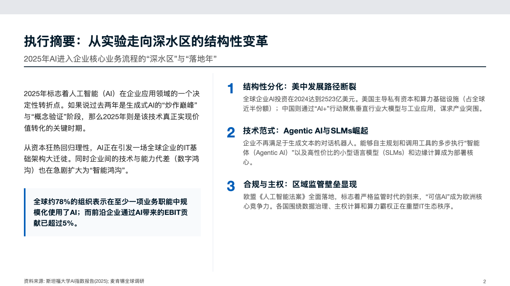
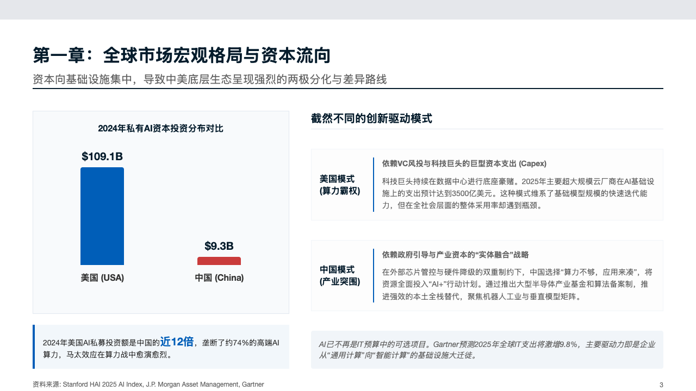
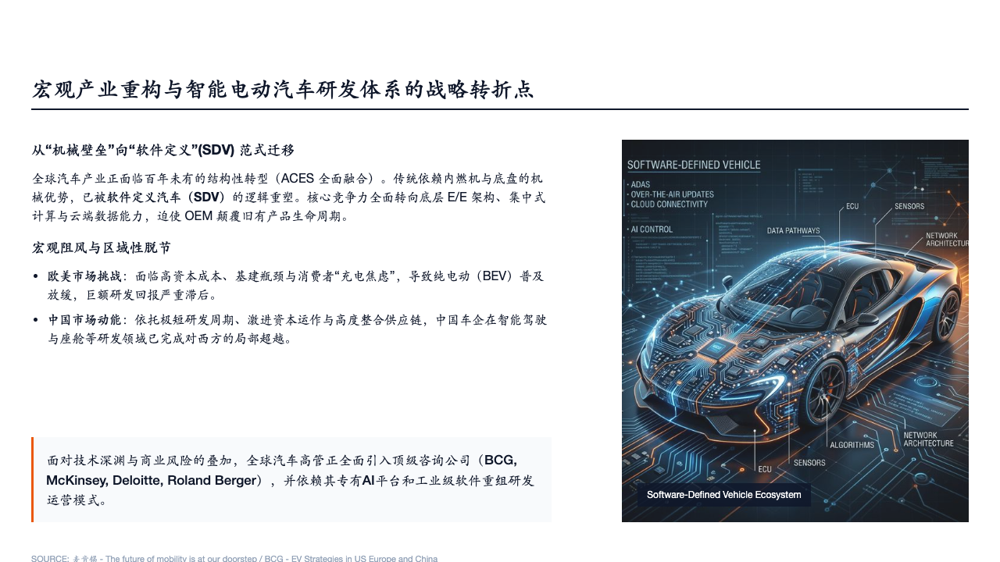
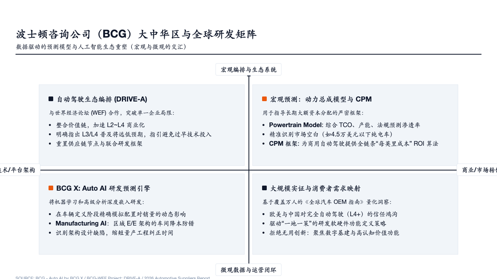
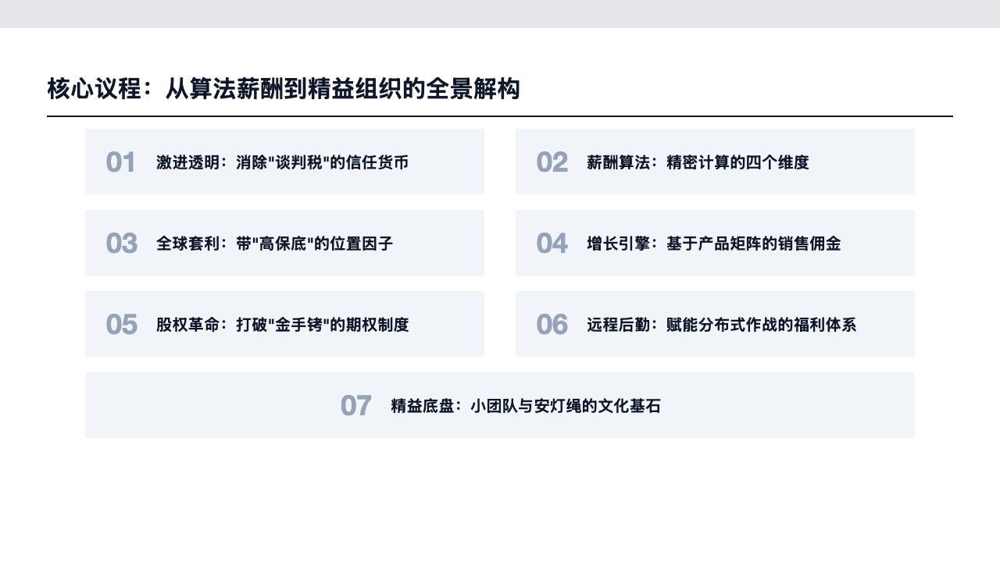
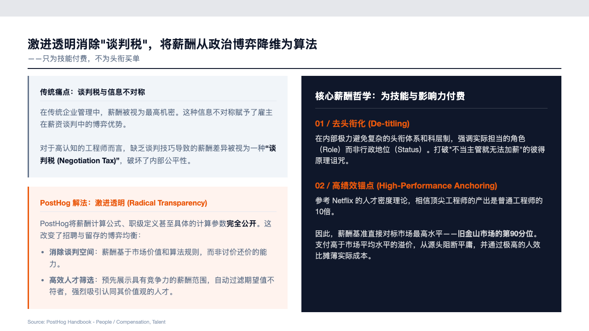
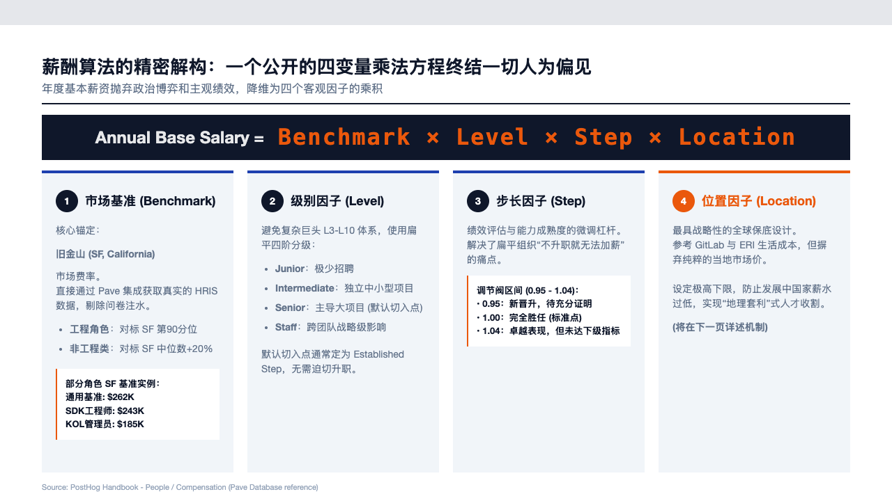
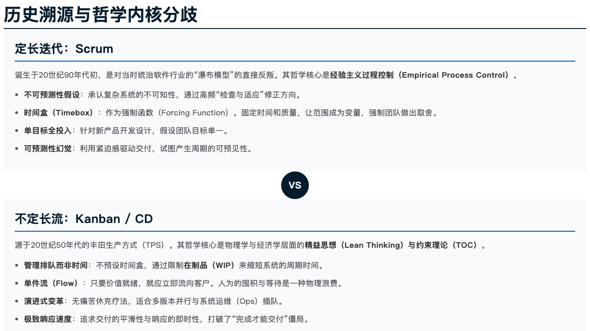
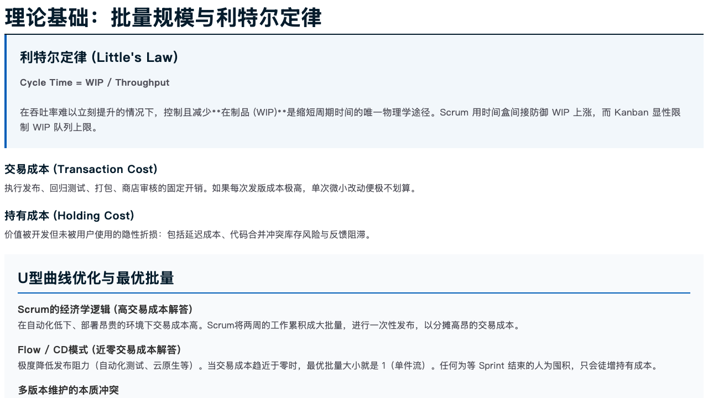
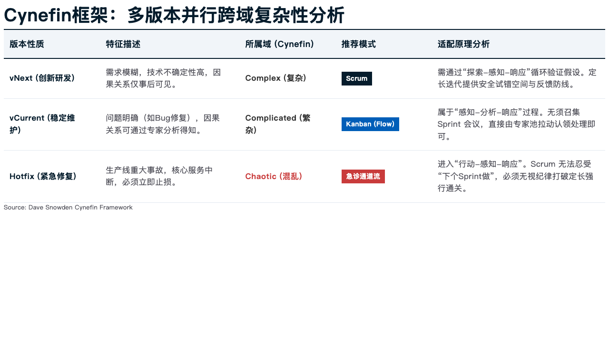

# Slide Creator Skill

Slide Creator 是一款由 AI 驱动的“非结构化文本到专业演讲 HTML 幻灯片”转化引擎。基于原生 24x24 绝对 CSS 栅格系统构建，提供像素级精度的机构级 (McKinsey / Business) 排版控制。通过本技能，AI Agent 或者个人可以直接将脑暴笔记、研究报告等文本，一次性转换为布局规整、可独立运行且无外部依赖的高质量网页幻灯片。

## ✨ 核心能力

- **文本重构与重排**：大模型会自动总结你的段落，并精准分类为标题、引言、多行小标题、和列表。
- **数学级栅格引擎**：不使用随机的 Flex 布局，严格将页面作为 24x24 坐标系计算布局边界，防止错位、重叠与溢出。
- **动态组件路由**：内置十余种布局模型 (Chart, Matrix, Pyramid, Process Flow, Timeline, Staircase, Funnel 等)，根据文本语境自动装配。
- **双模态防呆 QA**：提供纯生成和人工质检验收工作流。大模型完成初稿后，辅以原生 JS Puppeteer 脚本进行溢出边界计算和自动校验。

---

## 🎨 Gallery 展示案例

> 以下所有内容均为该 Skill 独立处理结构化并直接生成 HTML 渲染的结果：

### 1. 2025 AI 发展报告 (2025_AI_Report)

<div style="display: grid; grid-template-columns: repeat(2, 1fr); gap: 10px;">
  
  
  
  
</div>

<br/>

### 2. EV 研发咨询方案 (EV_RD_Consulting)

<div style="display: grid; grid-template-columns: repeat(2, 1fr); gap: 10px;">
  
  
  
  
</div>

<br/>

### 3. PostHog 薪资指南 (PostHog_Salary)

<div style="display: grid; grid-template-columns: repeat(2, 1fr); gap: 10px;">
  
  
  
  
</div>

<br/>

### 4. Scrum vs Flow 效率对比 (ScrumVsFlow)

<div style="display: grid; grid-template-columns: repeat(2, 1fr); gap: 10px;">
  
  
  
  
</div>

<br/>

> *注：上述截图并非全景，仅抽样展示前几张代表性布局。由于技能直接生成标准的 HTML/CSS，展示中涉及的占位图片均可在完成排版后由大模型按像素替换。*

---

## 🛠 开箱即用与环境依赖

- **Node.js**: 本地需安装 Node.js (v18+) 以执行打包与检测脚本。
- **NPM Modules**: 需要 `jsdom`、`css-tree` 以及 `puppeteer`。

*(本技能已内置 `package.json`，AI 助手在每次运行本技能时，会自动进行 `npm install` 前置检查和安装，用户几乎无阻塞即可上手。)*

## 🚀 安装与使用方法

如果你的交互型 AI 原生支持指令式安装：

```bash
# 使用 npx 直接在项目中加载这个 skill (仅供部分支持该指令的 AI 环境)
npx skills install slide-creator-skill
```

同样推荐直接 `git clone` 整个项目，或者将所在目录作为工作区交给诸如 Cursor, Gemini Agent, Cline 等带文件读写指令能力的 AI IDE。

### Prompt 触发示例

**场景一：全新生成一整套幻灯片**
把长文/调研扔给 AI，附加 Prompt：
> “使用你本地的 slide-creator-skill 帮我把这一份 3000 字的市场进入策略梳理成 12 页左右的商务报告 PPT。使用 Business 风格模板。”

AI 即会按照 `SKILL.md` 指南，逐页进行栅格尺寸的计算和生成拼接。

**场景二：启动脚本防边界溢出纠错 (QA Mode)**
当肉眼观察到某页排版的文字太多被挤压时：
> “启用 simple_layout_inspector.js 进行纠错。我发现 page 3 被截断了，用脚本探测重叠和溢出的对象并修正该对象的 span 占比和字号。”

