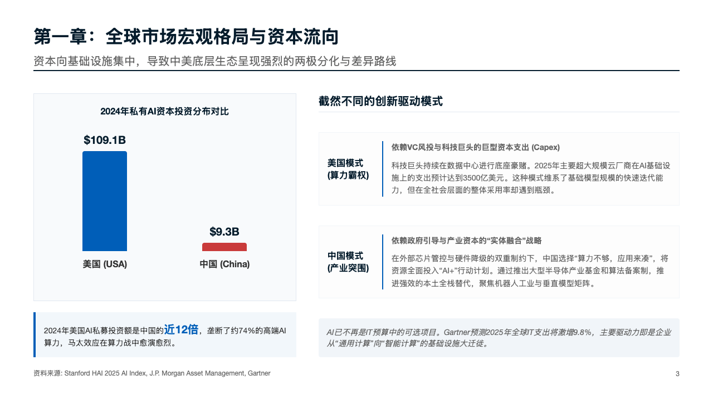
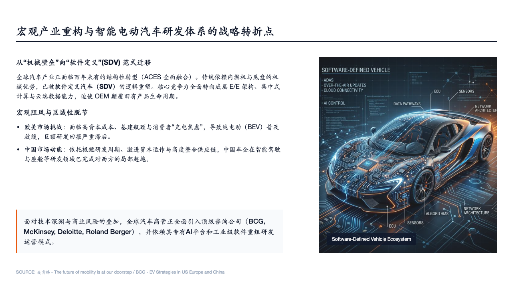
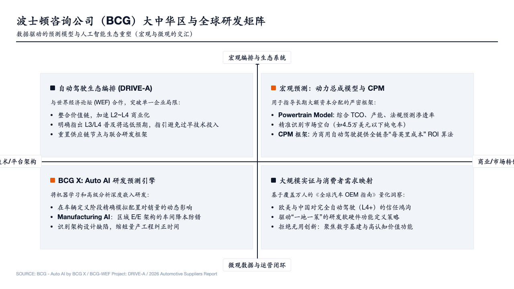
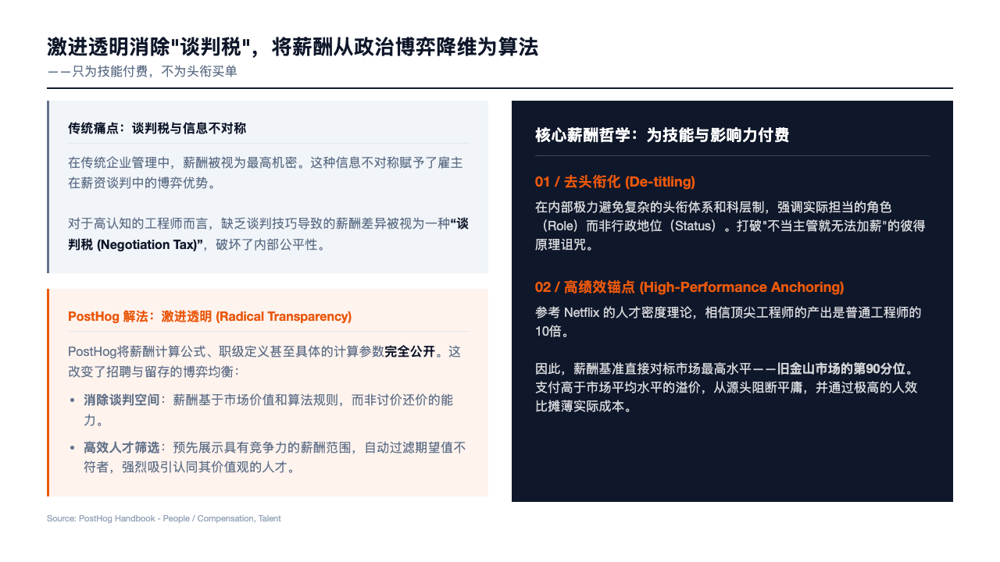
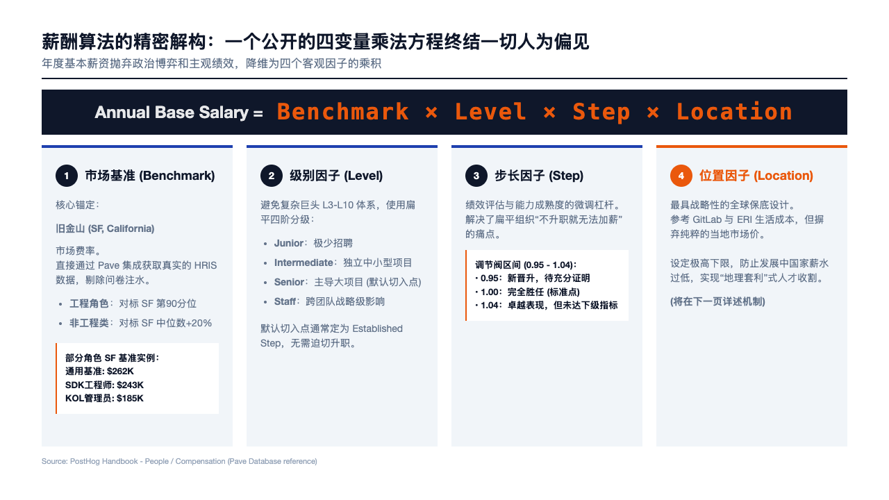
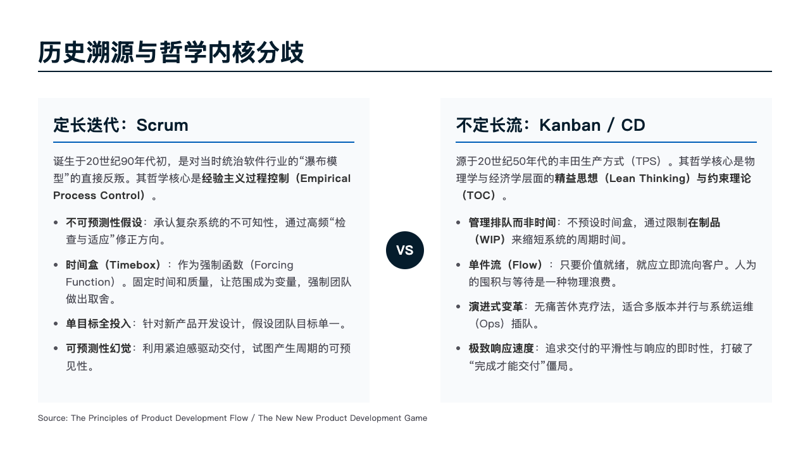
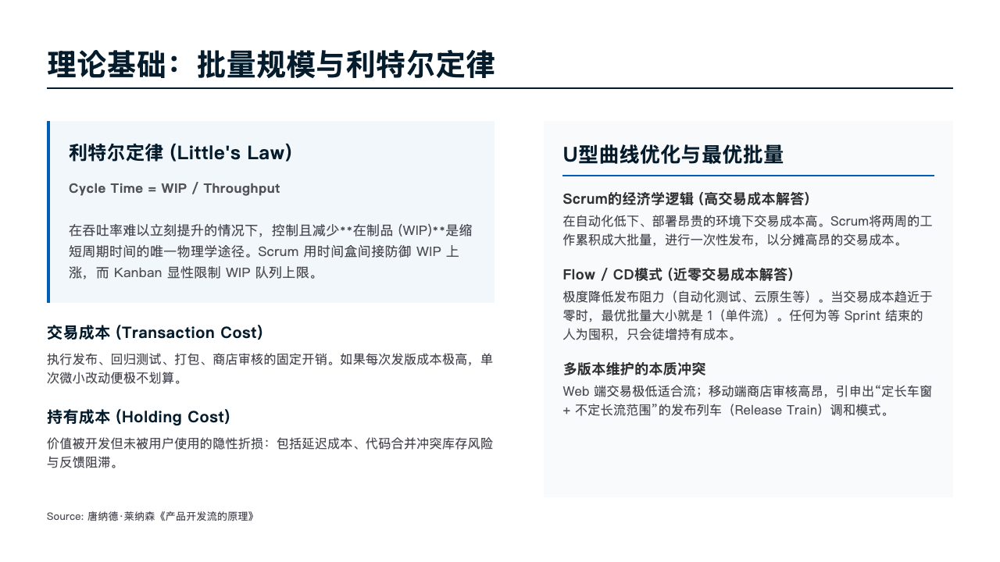
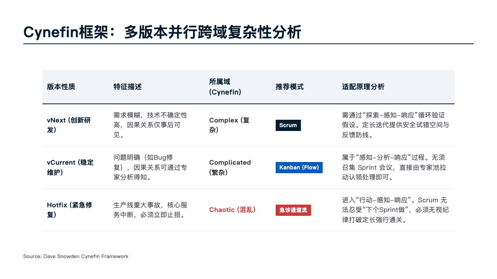

# Slide Creator Skill

Slide Creator skill 用于将Markdown文本直接转化为格式工整、排版专业的幻灯片网页。告别繁琐的手动排版，让 AI 为你搞定一切结构与美化工作。

## ✨ 核心能力

- **强大的组件库 (Components)**：打破单调的纯文本，内置矩阵 (Matrix)、漏斗 (Funnel)、流程树 (Process Flow)、阶梯式 (Staircase) 等商业报告中高频使用的十几款核心排版组件。AI 会根据你的大纲语境自动调配。
- **严谨的自动化检测 (Automated QA)**：害怕 AI 生成的排版文字重叠或者跑出框外？遇到此类问题，我们内置了自动排版巡检器。配合排版规范，AI 能够通过测量布局溢出实现问题自愈修正。
- **自定义风格 (Custom Styling)**：从经典的极简“麦肯锡风”，到色彩鲜明的“现代商务风”。所有的样式都能自由定制，甚至可为你的品牌打造自己专属的主题。

---


## 🎨 Gallery 展示案例

> 以下所有内容均为该 Skill 独立处理结构化并直接生成 HTML 渲染的结果：

### 1. 2025 AI 发展报告 (2025_AI_Report)

<div style="display: grid; grid-template-columns: repeat(2, 1fr); gap: 10px;">
  
  
  
  
</div>

<br/>

### 2. EV 研发咨询方案 (EV_RD_Consulting)

<div style="display: grid; grid-template-columns: repeat(2, 1fr); gap: 10px;">
  
  
  
  
</div>

<br/>

### 3. PostHog 薪资指南 (PostHog_Salary)

<div style="display: grid; grid-template-columns: repeat(2, 1fr); gap: 10px;">
  
  
  
  
</div>

<br/>

### 4. Scrum vs Flow 效率对比 (ScrumVsFlow)

<div style="display: grid; grid-template-columns: repeat(2, 1fr); gap: 10px;">
  
  
  
  
</div>

<br/>

> *注：上述截图并非全景，仅抽样展示前几张代表性布局。由于技能直接生成标准的 HTML/CSS，展示中涉及的占位图片均可在完成排版后由大模型按像素替换。*

---


## 🛠 开箱即用与环境依赖

- **Node.js**: 本地需安装 Node.js (v18+) 以执行打包与检测脚本。
- **NPM Modules**: 需要 `jsdom`、`css-tree` 以及 `puppeteer`。

打开终端并进入项目根目录，通过以下 npm 命令安装所需依赖：

```bash
npm install
```

## 🚀 安装与使用方法

如果你的交互型 AI 原生支持指令式安装：

```bash
npx skills add exceedhl/slide-creator-skill
```

### 方式二：直接复制目录 (Direct Copy)

1. 下载或 Clone 本项目。
2. 将解压出的整个 `slide-creator-skill` 文件夹，直接复制搬运到你工程空间里的 Agent 技能目录（例如 `.agents/skills/` 之下）。
3. Agent 会在上下文中自动识别到 `SKILL.md` 的存在并自主加载这套排版工具能力。

---

### Prompt 触发示例

**场景一：全新生成一整套幻灯片**
把长文/调研扔给 AI，附加 Prompt：
> “使用你本地的 slide-creator-skill 帮我把这份市场进入策略生成 12 页左右的slide deck。使用 Business 风格模板。”

AI 即会按照 `SKILL.md` 指南，逐页进行栅格尺寸的计算和生成拼接。

**场景二：启动脚本防边界溢出纠错 (QA Mode)**
当肉眼观察到某页排版的文字太多被挤压时：
> “检查并迭代优化”


## 🤖 模型兼容性推荐 (Supported Models)

本技能在 **Gemini 3.1**, **GLM 5.1**, 以及 **Claude 3.6** 上目前表现都还不错，2-3轮对话可以得到整体满意的结果。**Gemini 3.1 Pro**表现相对优秀。
